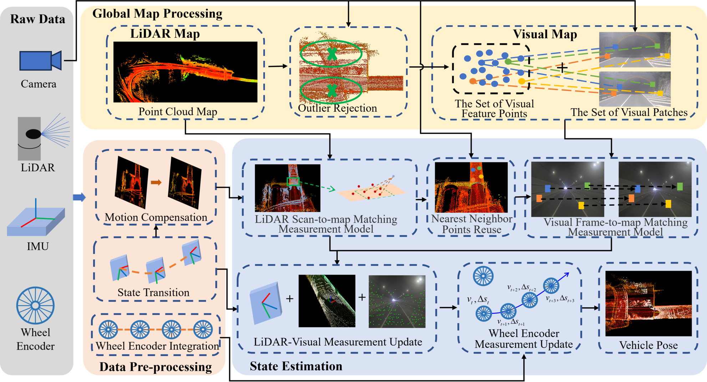

# LIVW-Localization
LIVW-Localization: A Multimodal Information Fused Vehicle Localization Method for Complex, Large-Scale, and GNSS-Denied Environments

**Related video:** [LIVW-localization](https://youtu.be/EVDpuL647hg)

**Overview:**




## 1. Introduction

Accurate and robust vehicle localization is a key issue in autonomous driving. However, traditional vehicle localization methods usually have issues such as excessive reliance on GNSS, low localization accuracy and poor robustness to sensor degradation environments, etc. To solve the above problems, we propose a map-based vehicle localization method that fuses LiDAR, vision, IMU and wheel encoder, named LIVW-Localization. To fully utilize the complementary advantages of LiDAR and vision, we use pre-built LiDAR map and real-time visual patches to construct a local visual map. To extract more stable and high-quality visual feature points, we propose a method to reuse the nearest neighbor points retrieved from real-time LiDAR scan in a point cloud map as the initial selecting criteria for visual feature points. Moreover, we propose an efficient method to fuse a single wheel encoder to improve the vehicle localization accuracy. To validate the performance of the proposed method, qualitative and quantitative experiments are conducted in various complex scenes, such as tunnels, long corridor-like outdoor environments and highways. Experimental results show that our method outperforms the state-of-the-art methods, and the root mean square errors (RMSE) of translation and rotation are 0.395m and 0.007rad respectively in the 19.376km highway LHW-2 dataset. The implementation code of this paper is open-source on Github.

## 2. Prerequisited

### 2.1 Ubuntu and ROS

- Ubuntu 20.04
- ROS-Noetic

### 2.2 PCL && Eigen && OpenCV

PCL = 1.10.0,    Follow [PCL Installation](https://pointclouds.org/). 

Eigen=3.3.7,      Follow [Eigen Installation](https://eigen.tuxfamily.org/index.php?title=Main_Page).

OpenCV=4.2.0,  Follow [Opencv Installation](http://opencv.org/).

### 2.3 Sophus

 Sophus Installation for the non-templated/double-only version.

```bash
git clone https://github.com/strasdat/Sophus.git
cd Sophus
git checkout a621ff
mkdir build && cd build && cmake ..
make
sudo make install
```

### 2.4 Vikit

Vikit contains camera models, some math and interpolation functions that we need. Vikit is a catkin project, therefore, download it into your catkin workspace source folder.

```bash
cd ~/catkin_ws/src
git clone https://github.com/uzh-rpg/rpg_vikit.git
```

## 3. Build

Clone the repository and catkin_make:

```
cd ~/catkin_ws/src
git clone https://github.com/NEU-REAL/LIVW-Localization
cd ../
catkin_make
source ~/catkin_ws/devel/setup.bash
```

## 4. Run the package

Our datasets. Due to the sensitivity of geographic information, we apologize that our dataset cannot be made public. But if your own dataset can include the following topics, you can successfully run the code:

```
lid_topic:      	 type: sensor_msgs/PointCloud2
imu_topic: 			 type: sensor_msgs/Imu
img_topic:			 type: sensor_msgs/CompressedImage
wheel_encoder_topic: type: see `msg/encoder.msg`
```

Please note that you should edit the `config/xxx.yaml` to adapt your private dataset.

### 4.1 Run on your dataset

```
roslaunch livw_localization localization_velodyne_dataset.launch
rosbag play YOUR_DATASET.bag --clock
```


## 5. Acknowledgments

Thanks for [FAST-LIVO](https://github.com/hku-mars/FAST-LIVO), [FAST-LIO2](https://github.com/hku-mars/FAST_LIO) , [ikd-Tree](https://github.com/hku-mars/ikd-Tree) and [SVO2.0](https://github.com/uzh-rpg/rpg_svo_pro_open). 


## 6. Citation

```
@ARTICLE{Wang_LIVW-Localization_2024,
  author={Wang, Jibo and Shen, Zhaohui and Lan, Zhengyang and Pang, Chenglin and Fang, Zheng},
  journal={IEEE Sensors Journal}, 
  title={LIVW-Localization: A Multimodal Information Fused Vehicle Localization Method for Complex, Large-Scale, and GNSS-Denied Environments}, 
  year={2024},
  volume={24},
  number={19},
  pages={30315-30328},
  doi={10.1109/JSEN.2024.3434491}
}
```

